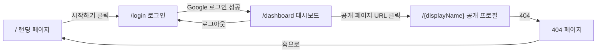
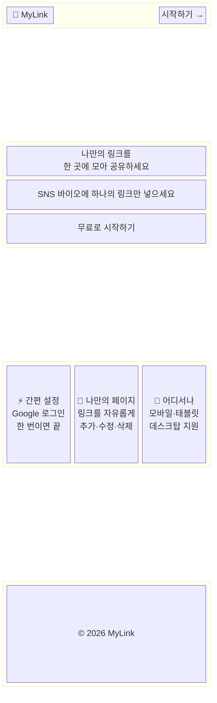
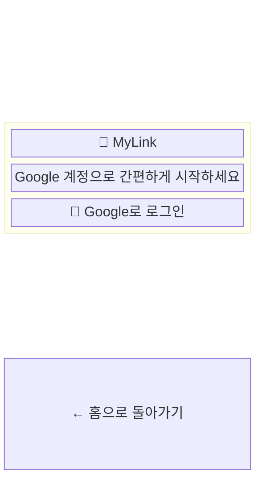
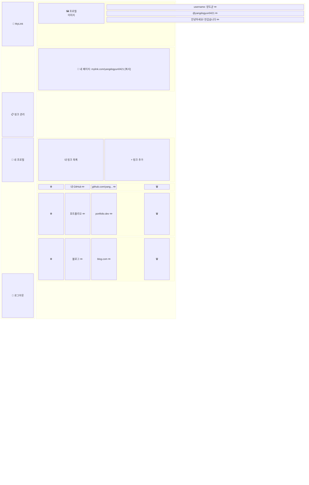
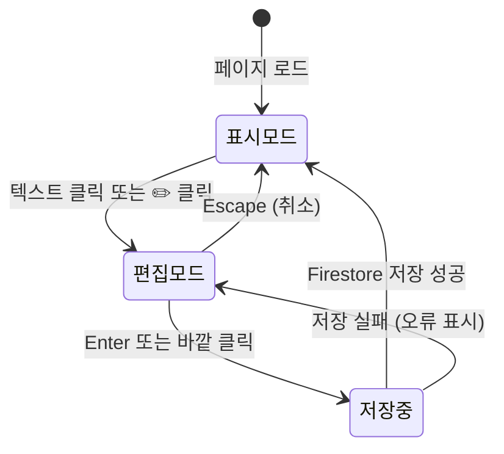
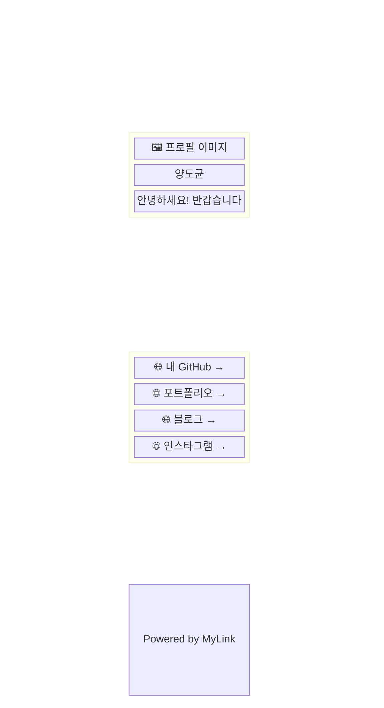

# 마이링크 (MyLink) - 와이어프레임

> **Version**: 1.0  
> **작성일**: 2026-06-27  
> **뷰포트**: 데스크탑 (1280px 기준)  
> **참조 문서**: [PRD](./prd.md) · [사용자 시나리오](./user-scenarios.md)

---

## 페이지 네비게이션 흐름



---

## 1. 랜딩 페이지 (`/`)

### 컴포넌트 구조



### ASCII 레이아웃

```
┌──────────────────────────────────────────────────────────┐
│  🔗 MyLink                                [시작하기 →]  │
├──────────────────────────────────────────────────────────┤
│                                                          │
│              나만의 링크를                                │
│           한 곳에 모아 공유하세요                         │
│                                                          │
│        SNS 바이오에 하나의 링크만 넣으세요               │
│                                                          │
│              ┌──────────────────┐                        │
│              │  무료로 시작하기  │                        │
│              └──────────────────┘                        │
│                                                          │
├──────────────────────────────────────────────────────────┤
│                    기능 소개                              │
│                                                          │
│  ┌────────────┐  ┌────────────┐  ┌────────────┐         │
│  │  ⚡ 간편    │  │  🎨 나만의  │  │  📱 어디서나│         │
│  │   설정      │  │   페이지   │  │            │         │
│  │            │  │            │  │  모바일·    │         │
│  │ Google     │  │ 링크를     │  │  태블릿·    │         │
│  │ 로그인     │  │ 자유롭게   │  │  데스크탑   │         │
│  │ 한 번이면  │  │ 추가·수정  │  │  지원       │         │
│  │ 끝         │  │ ·삭제      │  │            │         │
│  └────────────┘  └────────────┘  └────────────┘         │
│                                                          │
├──────────────────────────────────────────────────────────┤
│                  © 2026 MyLink                           │
└──────────────────────────────────────────────────────────┘
```

### 요소 설명

| 영역 | 요소 | 설명 |
|------|------|------|
| **Header** | 로고 | 서비스 로고 (좌측 고정) |
| **Header** | CTA 버튼 | "시작하기" → `/login`으로 이동 |
| **Hero** | 메인 타이틀 | 서비스 핵심 가치를 한 줄로 전달 |
| **Hero** | 서브 타이틀 | 부가 설명 |
| **Hero** | CTA 버튼 | "무료로 시작하기" → `/login`으로 이동 |
| **Features** | 기능 카드 ×3 | 아이콘 + 제목 + 한 줄 설명으로 구성 |
| **Footer** | 저작권 표시 | 간단한 저작권 텍스트 |

---

## 2. 로그인 페이지 (`/login`)

### 컴포넌트 구조



### ASCII 레이아웃

```
┌──────────────────────────────────────────────────────────┐
│                                                          │
│                                                          │
│                                                          │
│              ┌──────────────────────────┐                │
│              │                          │                │
│              │       🔗 MyLink          │                │
│              │                          │                │
│              │  Google 계정으로          │                │
│              │  간편하게 시작하세요      │                │
│              │                          │                │
│              │  ┌────────────────────┐  │                │
│              │  │ 🔵 Google로 로그인  │  │                │
│              │  └────────────────────┘  │                │
│              │                          │                │
│              └──────────────────────────┘                │
│                                                          │
│              ← 홈으로 돌아가기                           │
│                                                          │
└──────────────────────────────────────────────────────────┘
```

### 요소 설명

| 영역 | 요소 | 설명 |
|------|------|------|
| **카드** | 로고 | 서비스 로고 |
| **카드** | 안내 문구 | 로그인 유도 텍스트 |
| **카드** | Google 버튼 | Firebase Auth Google 로그인 팝업 트리거 |
| **하단** | 돌아가기 링크 | `/`로 이동하는 텍스트 링크 |

---

## 3. 대시보드 (`/dashboard`)

### 컴포넌트 구조



### ASCII 레이아웃

```
┌────────────┬─────────────────────────────────────────────┐
│            │                                             │
│ 🔗 MyLink  │  ┌─────────────────────────────────────┐    │
│            │  │ 🖼️   username: 양도균          [✏️]  │    │
│ ────────── │  │      @yangdogyun0421           [✏️]  │    │
│            │  │      안녕하세요! 반갑습니다      [✏️]  │    │
│ 📋 링크관리 │  └─────────────────────────────────────┘    │
│ 👤 내프로필 │                                             │
│            │  ┌─────────────────────────────────────┐    │
│            │  │ 🔗 mylink.com/yangdogyun0421  [복사] │    │
│            │  └─────────────────────────────────────┘    │
│            │                                             │
│            │  내 링크 목록                  [+ 링크 추가] │
│            │  ─────────────────────────────────────────  │
│            │                                             │
│            │  ┌─────────────────────────────────────┐    │
│            │  │ 🌐  내 GitHub      github.com/y...  🗑️│    │
│            │  │     [✏️ 인라인편집]  [✏️ 인라인편집]     │    │
│            │  └─────────────────────────────────────┘    │
│            │                                             │
│            │  ┌─────────────────────────────────────┐    │
│            │  │ 🌐  포트폴리오     portfolio.dev    🗑️│    │
│            │  │     [✏️ 인라인편집]  [✏️ 인라인편집]     │    │
│            │  └─────────────────────────────────────┘    │
│            │                                             │
│            │  ┌─────────────────────────────────────┐    │
│            │  │ 🌐  블로그          blog.com        🗑️│    │
│            │  │     [✏️ 인라인편집]  [✏️ 인라인편집]     │    │
│ ────────── │  └─────────────────────────────────────┘    │
│ 🚪 로그아웃 │                                             │
└────────────┴─────────────────────────────────────────────┘
```

### 요소 설명

| 영역 | 요소 | 설명 |
|------|------|------|
| **사이드바** | 로고 | 서비스 로고 |
| **사이드바** | 메뉴 항목 | 링크 관리, 내 프로필 (같은 페이지 내 스크롤/포커스) |
| **사이드바** | 로그아웃 | 하단 고정. 클릭 시 로그아웃 처리 |
| **프로필** | 아바타 | Google 프로필 사진 (원형, 읽기 전용) |
| **프로필** | username | 닉네임 표시. ✏️ 클릭 또는 텍스트 클릭 → 인라인 편집 |
| **프로필** | displayName | URL 식별자 표시 (`@` 접두어). 인라인 편집 + 중복 검사 |
| **프로필** | Bio | 소개글. 인라인 편집 |
| **URL 바** | 내 페이지 URL | 소유자의 공개 페이지 URL 표시 + 복사 버튼 |
| **링크 목록** | 헤더 | "내 링크 목록" 타이틀 + "링크 추가" 버튼 |
| **링크 카드** | 파비콘 | Google Favicon API로 로드된 아이콘 (좌측) |
| **링크 카드** | 제목 | 링크 제목. 클릭 → 인라인 편집 |
| **링크 카드** | URL | 링크 URL. 클릭 → 인라인 편집 |
| **링크 카드** | 삭제 버튼 | 🗑️ 클릭 → 확인 다이얼로그 → 삭제 |

### 인라인 편집 상태 전환



---

## 3-1. 대시보드 상세 UI 상태

> 아래는 대시보드에서 발생하는 각종 인터랙션의 **세부 UI 상태**를 보여줍니다.

### 3-1-1. 링크 추가 폼 (S-02)

> "링크 추가" 버튼 클릭 시 나타나는 입력 폼입니다.

```
  내 링크 목록                                    [+ 링크 추가]
  ─────────────────────────────────────────────────────────────

  ┌─────────────────────────────────────────────────────────┐
  │  ✨ 새 링크 추가                                        │
  │                                                         │
  │  제목                                                   │
  │  ┌───────────────────────────────────────────────────┐  │
  │  │ 링크 제목을 입력하세요                             │  │
  │  └───────────────────────────────────────────────────┘  │
  │                                                         │
  │  URL                                                    │
  │  ┌───────────────────────────────────────────────────┐  │
  │  │ https://                                          │  │
  │  └───────────────────────────────────────────────────┘  │
  │                                                         │
  │              [취소]              [저장]                  │
  └─────────────────────────────────────────────────────────┘

  ┌─────────────────────────────────────────────────────────┐
  │ 🌐  내 GitHub          github.com/yang...            🗑️ │
  └─────────────────────────────────────────────────────────┘
  ...
```

| 요소 | 설명 |
|------|------|
| 제목 입력 필드 | placeholder: "링크 제목을 입력하세요" |
| URL 입력 필드 | placeholder: "https://". 유효성 검증 대상 |
| 취소 버튼 | 폼을 닫고 원래 상태로 복귀 |
| 저장 버튼 | Firestore에 링크 문서 생성 |

---

### 3-1-2. URL 유효성 오류 메시지 (S-02)

> URL 입력 시 `http://` 또는 `https://`로 시작하지 않는 경우 표시됩니다.

```
  │  URL                                                    │
  │  ┌───────────────────────────────────────────────────┐  │
  │  │ www.example.com                                   │  │
  │  └───────────────────────────────────────────────────┘  │
  │  ⚠️ URL은 http:// 또는 https://로 시작해야 합니다       │
```

---

### 3-1-3. 삭제 확인 다이얼로그 (S-04)

> 🗑️ 삭제 버튼 클릭 시 화면 중앙에 오버레이로 표시됩니다.

```
  ┌──────────────────────────────────────────────────┐
  │                                                  │
  │  ╔══════════════════════════════════════╗         │
  │  ║                                      ║         │
  │  ║    🗑️ 링크를 삭제하시겠습니까?       ║         │
  │  ║                                      ║         │
  │  ║    "내 GitHub" 링크가                ║         │
  │  ║    영구적으로 삭제됩니다.            ║         │
  │  ║                                      ║         │
  │  ║        [취소]        [삭제]          ║         │
  │  ║                                      ║         │
  │  ╚══════════════════════════════════════╝         │
  │                                                  │
  └──────────────────────────────────────────────────┘
```

| 요소 | 설명 |
|------|------|
| 삭제 대상 표시 | 삭제할 링크의 제목을 명시하여 실수 방지 |
| 취소 버튼 | 다이얼로그를 닫고 원래 상태로 복귀 |
| 삭제 버튼 | Firestore에서 링크 문서 삭제 실행 (강조 색상) |

---

### 3-1-4. 인라인 편집 활성 상태 (S-03, S-05)

> 텍스트를 클릭하여 편집 모드로 전환된 상태의 실제 UI입니다.

**프로필 인라인 편집 (username 수정 중)**:

```
  ┌─────────────────────────────────────────────────────┐
  │ 🖼️   ┌─────────────────────────────┐          [✓][✕]│
  │      │ 양도균_                      │                │
  │      └─────────────────────────────┘                │
  │      @yangdogyun0421                          [✏️]  │
  │      안녕하세요! 반갑습니다                    [✏️]  │
  └─────────────────────────────────────────────────────┘
```

**링크 인라인 편집 (제목 수정 중)**:

```
  ┌─────────────────────────────────────────────────────┐
  │ 🌐  ┌──────────────────────┐                        │
  │     │ 내 GitHub 프로필_     │  github.com/yang... 🗑️ │
  │     └──────────────────────┘  [✏️ 인라인편집]        │
  │     Enter: 저장 / Esc: 취소                         │
  └─────────────────────────────────────────────────────┘
```

| 상태 | UI 변화 |
|------|---------|
| **표시 모드** (기본) | 일반 텍스트 + ✏️ 아이콘 |
| **편집 모드** (활성) | 텍스트가 입력 필드로 전환 + 커서 깜빡임 + ✓/✕ 또는 "Enter/Esc" 힌트 |
| **저장 중** | 입력 필드 비활성화 + 로딩 스피너 표시 |

---

### 3-1-5. displayName 중복 검사 피드백 (S-05 흐름B)

> displayName 인라인 편집 시 실시간으로 표시되는 중복 검사 결과입니다.

**사용 가능한 경우**:

```
  │      @┌───────────────────────────┐          [✓][✕]│
  │       │ newdisplayname_            │                │
  │       └───────────────────────────┘                │
  │       ✅ 사용 가능한 이름입니다                      │
  │       ⚠️ URL이 mylink.com/newdisplayname 으로       │
  │          변경됩니다                                  │
```

**이미 사용 중인 경우**:

```
  │      @┌───────────────────────────┐          [✓][✕]│
  │       │ existinguser_              │                │
  │       └───────────────────────────┘                │
  │       ❌ 이미 사용 중인 이름입니다                    │
```

| 상태 | 메시지 | 저장 가능 여부 |
|------|--------|--------------|
| 검사 중 | 🔄 확인 중... | 불가 |
| 사용 가능 | ✅ 사용 가능 + ⚠️ URL 변경 경고 | 가능 |
| 중복 | ❌ 이미 사용 중 | 불가 (저장 버튼 비활성화) |

---

### 3-1-6. 빈 상태 — 링크 0개 (S-12)

> 신규 가입 직후 또는 모든 링크를 삭제한 후, 링크 목록이 비어있을 때의 화면입니다.

```
  내 링크 목록                                    [+ 링크 추가]
  ─────────────────────────────────────────────────────────────

  ┌─────────────────────────────────────────────────────────┐
  │                                                         │
  │                      🔗                                 │
  │                                                         │
  │           아직 등록된 링크가 없습니다.                   │
  │        첫 번째 링크를 추가해 보세요!                    │
  │                                                         │
  │              ┌────────────────────┐                     │
  │              │   + 링크 추가하기   │                     │
  │              └────────────────────┘                     │
  │                                                         │
  └─────────────────────────────────────────────────────────┘
```

| 요소 | 설명 |
|------|------|
| 아이콘 | 비어있음을 시각적으로 표현 |
| 안내 메시지 | 사용자를 링크 추가로 유도하는 문구 |
| CTA 버튼 | "링크 추가하기" → 링크 추가 폼(3-1-1) 표시 |

---

## 4. 공개 프로필 페이지 (`/{displayName}`)

### 컴포넌트 구조



### ASCII 레이아웃 (와이드)

```
┌──────────────────────────────────────────────────────────────────────┐
│                                                                      │
│                                                                      │
│     ┌──────────┐                                                     │
│     │          │                                                     │
│     │  🖼️ 사진  │    양도균                                          │
│     │          │    안녕하세요! 반갑습니다                            │
│     └──────────┘                                                     │
│                                                                      │
│     ┌────────────────────────────────────────────────────────────┐   │
│     │  🌐  내 GitHub                                          → │   │
│     └────────────────────────────────────────────────────────────┘   │
│                                                                      │
│     ┌────────────────────────────────────────────────────────────┐   │
│     │  🌐  포트폴리오                                         → │   │
│     └────────────────────────────────────────────────────────────┘   │
│                                                                      │
│     ┌────────────────────────────────────────────────────────────┐   │
│     │  🌐  블로그                                             → │   │
│     └────────────────────────────────────────────────────────────┘   │
│                                                                      │
│     ┌────────────────────────────────────────────────────────────┐   │
│     │  🌐  인스타그램                                         → │   │
│     └────────────────────────────────────────────────────────────┘   │
│                                                                      │
│                       Powered by MyLink                              │
│                                                                      │
└──────────────────────────────────────────────────────────────────────┘
```

### 요소 설명

| 영역 | 요소 | 설명 |
|------|------|------|
| **프로필** | 아바타 | Google 프로필 사진 (원형) |
| **프로필** | username | 소유자의 닉네임/표시 이름 |
| **프로필** | Bio | 소개글 |
| **링크 카드** | 파비콘 | Google Favicon API로 로드 (좌측) |
| **링크 카드** | 제목 | 링크 제목 텍스트 |
| **링크 카드** | 화살표 | 외부 링크임을 시각적으로 표현 |
| **Footer** | 서비스 로고 | "Powered by MyLink" 브랜딩 |

> [!NOTE]
> - 와이드 레이아웃 기준으로, 프로필 영역과 링크 카드가 화면 너비를 넉넉하게 활용합니다.
> - 링크 카드 클릭 시 새 탭(`target="_blank"`)으로 해당 URL이 열립니다.
> - 비로그인 상태에서도 접근 가능한 공개 페이지입니다.

---

## 5. 404 에러 페이지

### ASCII 레이아웃

```
┌──────────────────────────────────────────────────────────┐
│                                                          │
│                                                          │
│                         404                              │
│                                                          │
│           페이지를 찾을 수 없습니다                      │
│                                                          │
│        요청하신 페이지가 존재하지 않습니다.              │
│                                                          │
│              ┌──────────────────┐                        │
│              │   홈으로 돌아가기 │                        │
│              └──────────────────┘                        │
│                                                          │
└──────────────────────────────────────────────────────────┘
```

---

## 6. 제안: 추가 고려 사항

> [!TIP]
> 와이어프레임 작성 과정에서 발견된 추가 제안 사항입니다.

| # | 제안 | 설명 | 상태 |
|---|------|------|------|
| 1 | **URL 복사 버튼** | 대시보드에 공개 페이지 URL 원클릭 복사 | ✅ 반영 (대시보드 3번) |
| 2 | **링크 추가 폼** | "링크 추가" 클릭 시 제목/URL 입력 폼 | ✅ 반영 (3-1-1) |
| 3 | **빈 상태(Empty State)** | 링크 0개일 때 안내 메시지 + CTA | ✅ 반영 (3-1-6) |
| 4 | **displayName 변경 경고** | 수정 시 "URL이 변경됩니다" 경고 | ✅ 반영 (3-1-5) |
| 5 | **삭제 확인 다이얼로그** | 삭제 전 확인 팝업 | ✅ 반영 (3-1-3) |
| 6 | **인라인 편집 활성 UI** | 편집 모드 전환 시 실제 입력 필드 모습 | ✅ 반영 (3-1-4) |
| 7 | **URL 유효성 오류** | 잘못된 URL 입력 시 에러 메시지 | ✅ 반영 (3-1-2) |
